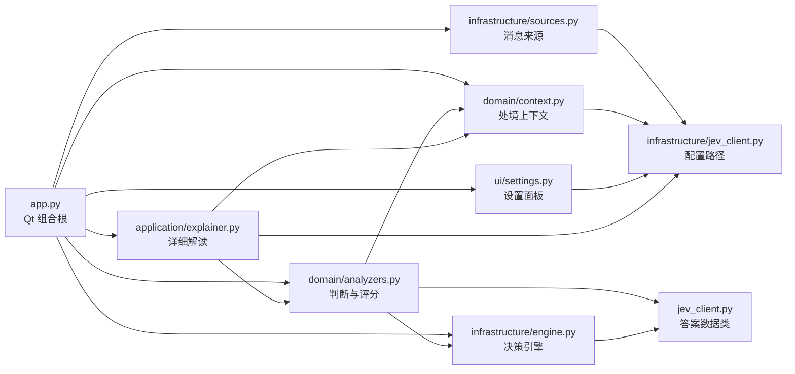
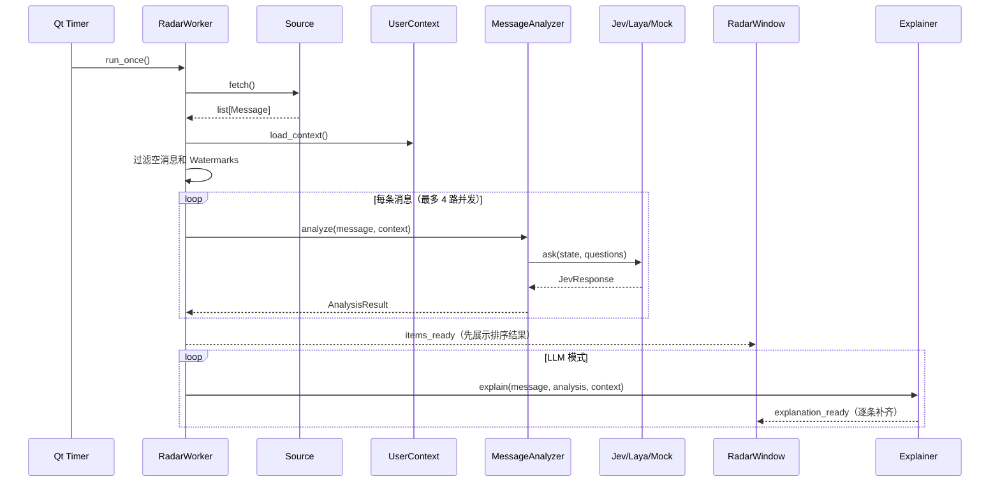

# Chirp 工程结构

本文描述当前仓库的真实工程边界。Chirp 是一个单进程 macOS PySide6 应用：前端窗口、消息读取、决策模型调用和本地状态都在同一个 Python 进程中完成，不依赖项目自带的后端服务。

## 1. 目录总览

```text
Chirp/
├── main.py                       # 兼容旧运行方式的入口
├── pyproject.toml                # 包元数据、依赖和 chirp 命令
├── src/chirp/                    # 正式 Python 包
│   ├── app.py                    # 应用启动和依赖组装
│   ├── domain/                   # 分析规则与处境上下文
│   ├── infrastructure/           # DWS、Jev、Laya、缓存适配
│   ├── application/              # LLM 解读服务
│   ├── ui/                       # Qt 窗口、后台 worker 和设置
│   └── assets/                   # 应用图标
│
├── scripts/                      # 开发、数据准备、冒烟、回归和模型诊断
│   ├── build_inbox.py            # 将 DWS 原始 JSON 组合成 inbox.json
│   ├── demo_context.py           # 构造空闲/忙碌处境进行演示
│   ├── smoke_dws.py              # 检查 DWS CLI 和消息读取
│   ├── smoke_jev.py              # 检查 Jev Key 和返回结构
│   ├── smoke_llm.py              # 检查 OpenAI 兼容 LLM
│   ├── smoke_pipeline.py         # 无 UI 的端到端流水线
│   ├── smoke_ui.py               # 启动窗口进行手工冒烟
│   ├── check_regressions.py      # Qt 回归测试和截图
│   ├── test_engine.py            # 引擎工厂、答案解析和后端无关性
│   ├── test_explainer.py         # 模板解读和回复选项
│   ├── test_dimensions.py        # 排序维度和处境信号
│   ├── test_async.py             # 两阶段异步刷新
│   ├── test_ui_render.py         # 组件渲染与复制交互
│   ├── test_laya.py              # Laya 实际模型检查
│   └── debug_laya.py …           # debug_laya2～5：Laya 输出诊断脚本
│
├── artifacts/                    # 本地验证生成的截图/构建日志，不是运行时输入
├── docs/                         # 路演等项目文档和演示材料
├── requirements.txt              # PySide6，云端/Mock 模式依赖
├── requirements-local.txt        # Laya、ModelScope 及本地推理依赖
├── build_app.sh                  # 当前推荐的 PyInstaller 打包入口
├── 吱一声-x86_64.spec             # 云端/轻量包 spec
├── 钉钉雷达-x86_64.spec           # 兼容旧名称的 spec
├── .env.example                  # 无凭据配置模板
├── .gitignore                    # 本地配置、缓存、构建物和日志忽略规则
├── README.md                     # 产品、安装、配置和操作说明
└── ARCHITECTURE.md               # 本文
```

以下目录按需生成并被忽略，不属于源码交付物：

```text
.env                 # 源码运行时的本地配置
.cache/              # 消息快照、上下文和隐藏水位
build/               # PyInstaller 中间文件
dist/                # macOS .app 输出
__pycache__/         # Python 字节码缓存
```

打包应用把 `.env` 和 `.cache/` 放到 `~/.dingtalk-radar/`。应用包本身不携带凭据、会话快照或 DWS 登录态。

## 2. 模块职责和依赖方向

模块之间按“输入适配 → 领域判断 → 展示编排”的方向依赖：



### `src/chirp/app.py` 与 `src/chirp/ui/window.py`

`app.py` 是应用组合根，负责加载配置、选择消息来源和决策引擎、创建 Qt 应用以及启动 `RadarWindow`。`ui/window.py` 包含窗口、后台 worker 和交互状态；根目录 `main.py` 只做兼容转发。

文件内部目前包含四类职责：

- `RadarItem`：把一条 `Message`、一个 `AnalysisResult` 和可选 `Explanation` 组合成 UI 项目。
- `Watermarks`：以会话为粒度保存“已处理到哪个时间点”，写入 `.cache/watermarks.json`。
- `RadarWorker`：后台执行拉取、上下文加载、并发分析和第二阶段解读，通过 Qt Signal 把结果交给窗口。
- `CardWidget`、`DetailWidget`、`RadarWindow`：列表卡片、详情页、设置/刷新/暂停/跳转/忽略等交互。

UI 层直接依赖领域和基础设施层，依赖组装集中在 `app.py`。后续新增功能应优先放入对应子包，避免再次把业务逻辑塞回窗口文件。

### `sources.py`：消息输入适配

所有来源都实现 `Source.fetch() -> list[Message]`，先把外部数据归一化成内部 `Message`：

- `DwsSource`：调用已登录的官方 `dws` CLI，先取未读会话，再补取每个会话的最近消息。
- `CacheSource`：读取 `.cache/inbox.json`，适合无 DWS、离线回归或外部任务先行同步数据的场景。
- `MockSource`：使用内置或 `RADAR_MOCK_FILE` 指定的消息，供 UI 和流水线开发。
- 辅助函数负责字段兼容、时间解析、自己发送的消息过滤和钉钉 deep link 生成。

`DwsSource` 只负责读取和解析，不把 DWS token 或 AppSecret 复制到本项目；登录态由 DWS 自己管理。

### `context.py`：处境上下文

`UserContext` 包含当前时间、当天日程、下一个日程、今日待办和未完成待办。`load_context()` 从 `.cache/context.json`（或 `RADAR_CONTEXT` 指定的文件）读取；文件缺失或损坏时返回只有当前时间的空上下文。

该模块不主动调用 DWS。日程/待办同步由外部流程完成，应用只消费标准化 JSON。

### `analyzers.py`：领域规则和排序

`MessageAnalyzer` 负责：

1. 构建意图、情绪、紧急度、重要度、操纵话术和自动回复判断题。
2. 将消息与 `UserContext` 序列化为模型输入。
3. 调用统一的 `DecisionEngine.ask()`。
4. 将模型答案转换为 `AnalysisResult`。
5. 计算综合分、PUA 风险、处境信号和回复规则。

该模块不关心 HTTP、Laya 加载或 Qt 控件；它只依赖引擎协议、答案类型和上下文模型。

### `engine.py`：决策引擎边界

`DecisionEngine` 是分析层看到的唯一接口：`ask(state, questions) -> JevResponse`。

- `JevEngine`：调用云端 Jev；问题批量合并成一次 HTTP 请求。
- `LayaEngine`：懒加载本地模型，按安全批大小拆分问题，再合并答案；首次运行从 ModelScope/Hugging Face 获取模型。
- `MockEngine`：确定性离线结果，用于 UI、回归和无 Key 开发。
- `make_engine()`：根据显式模式或 `RADAR_ENGINE` 选择实现，未配置时回退到 Mock。

分析层只依赖 `DecisionEngine`，因此三种引擎可以互换。

### `jev_client.py`：外部模型客户端和共享类型

这里定义 `NoulAnswer`、`ScoreAnswer`、`ChoiceAnswer`、`JevResponse` 等共享结果类型，并实现：

- `.env` 解析和配置路径选择；
- Jev HTTP 请求、鉴权头、重试和返回解析；
- `MockJevClient`，供 `MockEngine` 使用。

凭据来源只有进程环境变量和用户本地 `.env`。冻结应用首次运行只创建空的 `~/.dingtalk-radar/.env`，不会从应用包复制文件。

### `explainer.py`：第二阶段解读

`Explainer` 接收已有的 `AnalysisResult`，不参与第一阶段排序：

- `LLMClient`：访问用户提供的 OpenAI 兼容 `/chat/completions` 接口；
- LLM 可用时输出结构化 JSON，再归一化为 `Explanation`；
- 未配置或请求失败时使用本地模板，确保 UI 仍能显示；
- `make_llm_client()` 只在 Base URL、Key、Model 三项齐全时启用远程调用。

### `settings.py`：配置写入边界

设置窗口管理引擎模式、Jev Key、LLM 三元组、DWS 路径、自己的 senderId 和轮询间隔。保存时更新本地 `.env`，并同步当前进程环境变量，窗口随后热重载引擎、来源、解读器和轮询间隔。

## 3. 一次刷新和一次点击的生命周期



用户点击“跳转”或“忽略”时，`RadarWindow` 调用 `Watermarks.mark_handled()` 写入会话时间水位；下一次刷新会隐藏不晚于该水位的消息，更新消息仍会出现。

## 4. 配置和数据边界

| 数据 | 默认位置（源码） | 默认位置（`.app`） | 生产者 | 是否含敏感内容 |
| --- | --- | --- | --- | --- |
| `.env` | 项目根目录 | `~/.dingtalk-radar/.env` | 设置面板/用户 | 可能含 API Key |
| `inbox.json` | `.cache/inbox.json` | `~/.dingtalk-radar/.cache/inbox.json` | 外部同步或 `build_inbox.py` | 含消息和会话 ID |
| `context.json` | `.cache/context.json` | `~/.dingtalk-radar/.cache/context.json` | 外部同步流程 | 含日程和待办 |
| `last_unread.json` | `.cache/last_unread.json` | 同上 | `DwsSource` 调试输出 | 含 DWS 原始响应 |
| `watermarks.json` | `.cache/watermarks.json` | 同上 | `Watermarks` | 含会话 ID 和时间 |
| DWS 登录态 | DWS 自己的目录 | DWS 自己的目录 | DWS CLI | 不由 Chirp 管理 |

配置优先级是：进程环境变量优先于 `.env`；设置面板保存后会修改本地 `.env` 和当前进程环境。API Key、DWS token 和聊天数据都不应进入源码、spec、`.app` 或提交历史。

## 5. 脚本使用边界

| 类别 | 脚本 | 是否依赖真实服务 |
| --- | --- | --- |
| 纯逻辑 | `test_engine.py`、`test_explainer.py`、`test_dimensions.py` | 默认不需要 |
| 端到端 | `smoke_pipeline.py` | 默认使用自动选择的数据源和 Mock/已配置引擎 |
| UI | `check_regressions.py`、`test_ui_render.py`、`test_async.py`、`smoke_ui.py` | 需要 PySide6；可用 Mock |
| DWS | `smoke_dws.py` | 需要官方 DWS 登录态 |
| Jev/LLM | `smoke_jev.py`、`smoke_llm.py` | 需要外部 Key 和网络 |
| 数据准备 | `build_inbox.py`、`demo_context.py` | 前者需要原始 DWS JSON，后者离线 |
| Laya | `test_laya.py`、`debug_laya.py`～`debug_laya5.py` | 需要本地模型依赖和模型缓存 |

`debug_laya*.py` 是探索性诊断工具，不应作为发布门禁；发布前至少执行纯逻辑测试、Mock 流水线、Python 编译检查和无凭据扫描。

## 6. 打包边界

`build_app.sh` 是推荐入口：根据目标架构选择 Python 环境，用 PyInstaller 从 `src/chirp/app.py` 构建 `.app`，只显式加入图标资源，并在云端模式排除 Laya/Torch 等大型依赖。两个 `.spec` 文件保留给手工或历史构建场景；它们都不应加入 `.env`、`.cache` 或其他运行数据。

打包后仍需在目标机器上安装并登录官方 DWS，再通过设置面板配置模型和 CLI 路径。应用只负责读取 DWS，不负责复制其登录凭据。
